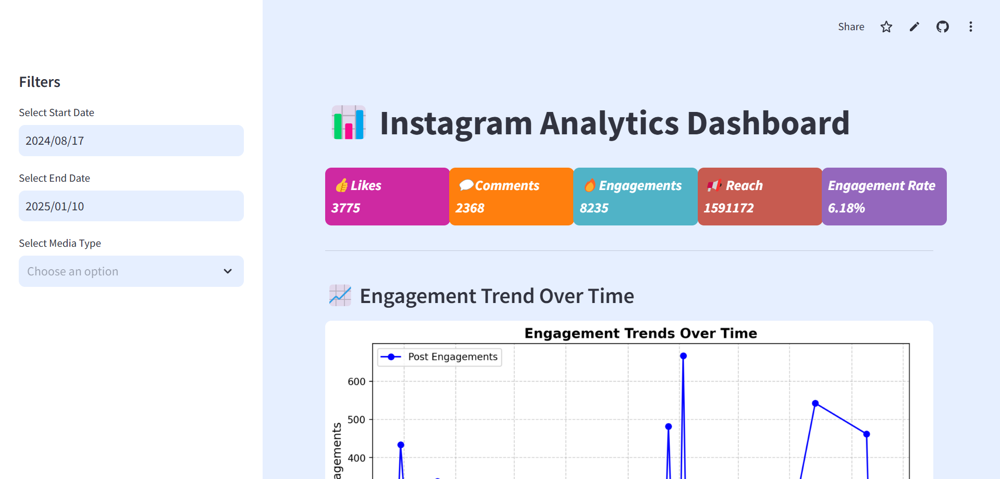
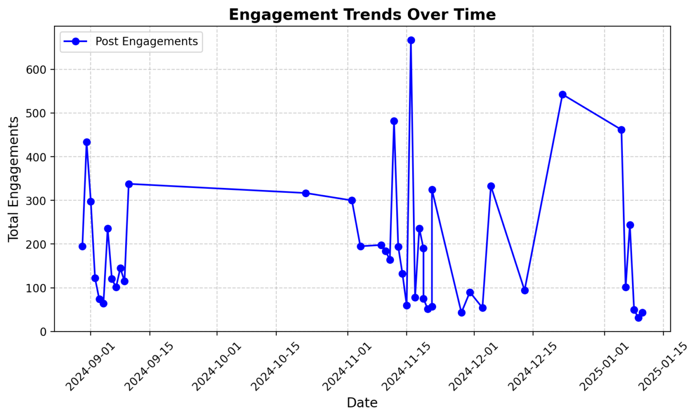
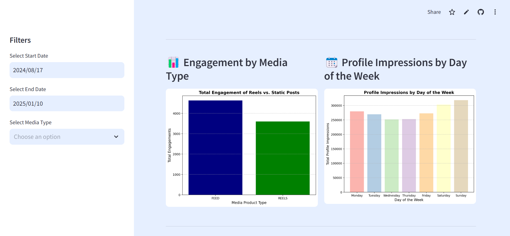
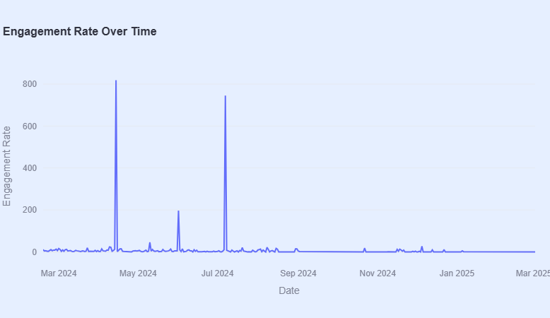
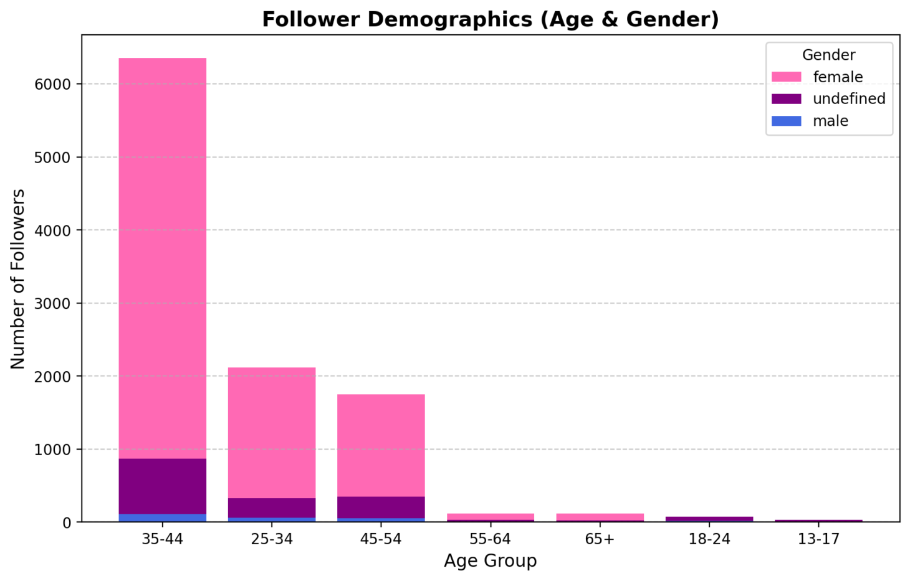
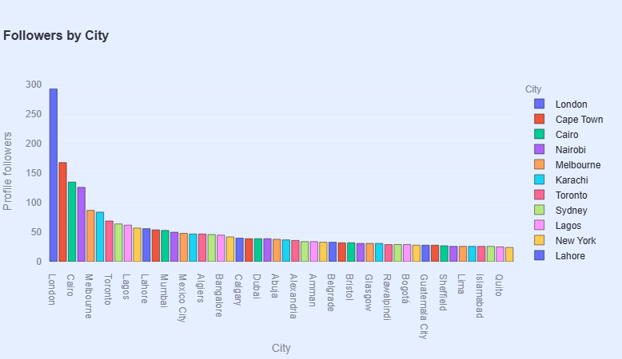

# 📊 Instagram Analytics Dashboard

This is a **fully interactive** dashboard built with `Streamlit`, `Pandas`, and `Plotly` to analyze Instagram engagement metrics.

## 🚀 Live Demo
🔗 **[View Dashboard on Streamlit](https://instagramanalyticsdashboard-zzvx5s63mgq9mginug2z77.streamlit.app/)**

## 📽️ Screencast Demo


## 📸 Screenshots







## 📂 Files in this Repository:
- `instagram_dashboard.py` → The main script
- `requirements.txt` → All necessary dependencies
- `README.md` → Project overview
- `config.toml` → Custom Streamlit theme settings

## 🛠️ How to Run Locally:
1. Clone this repo:  
   ```bash
   git clone https://github.com/ChiomaScripts/Instagram_Analytics_Dashboard.git

2. Navigate to the folder:

   ```cd Instagram_Analytics_Dashboard```

3. Install dependencies:

    ```pip install -r requirements.txt```

4. Run the dashboard:

    ```streamlit run instagram_dashboard.py```